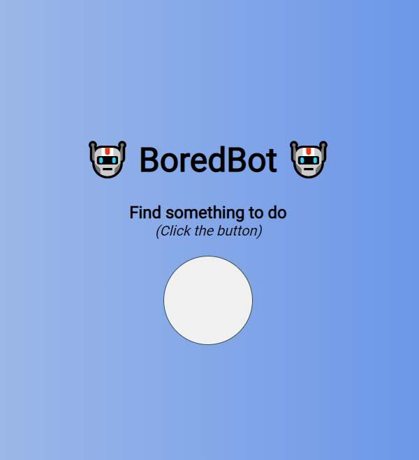

# Boredbot

This is the first project in Module 9 (Working with APIs) of Scrimba's [Frontend Developer Path](https://scrimba.com/learn/frontend). The main focus of this project is using the `fetch` API to get data from an external API and then chaining `.then` actions to the response, converting the fetched API response to JSON and rendering it.

The application calls the [Bored API](https://www.boredapi.com), but it does so via a [URL provided by Scrimba](https://apis.scrimba.com/bored/api/activity). This is done so that if the API ever gets discontinued, Scrimba can continue to support application functionality via their own implementation of the API data.

Deployed at: https://vish213-boredbot.netlify.app/

